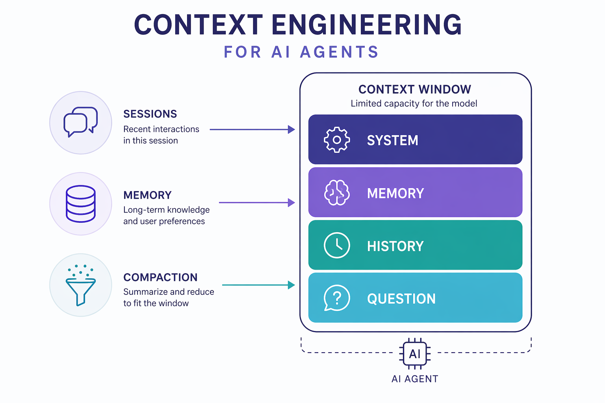
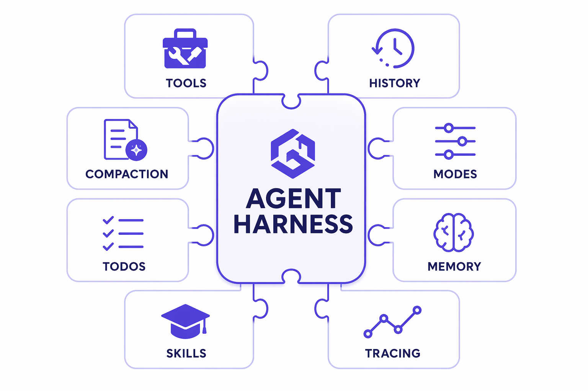
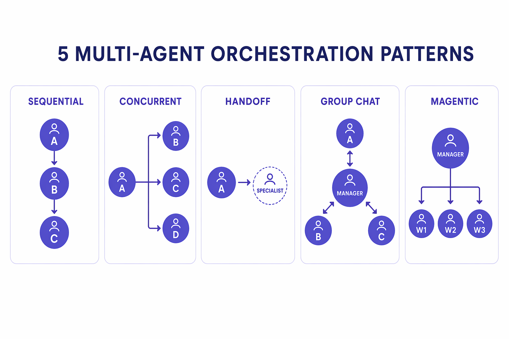
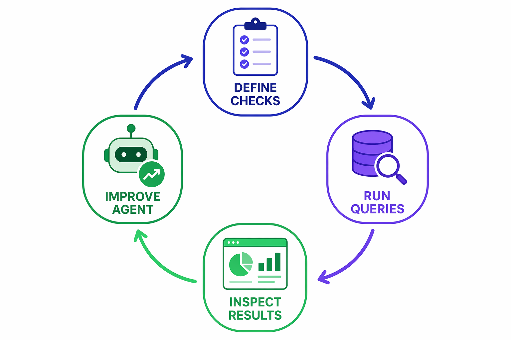
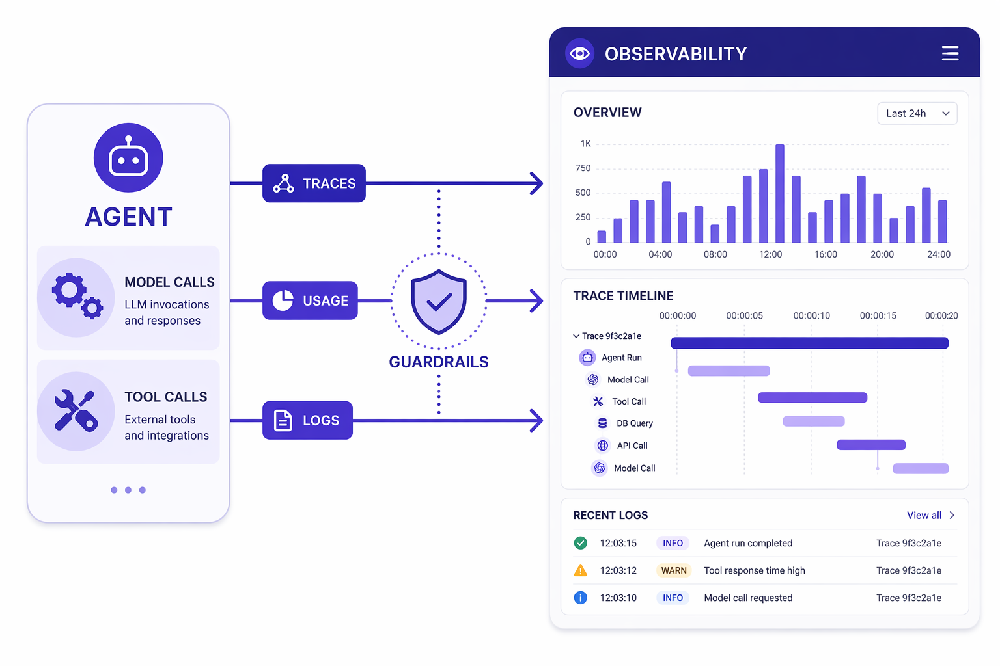

# Concepts — the mental model

This page is the thread that ties every lab together. Read it once before you
start; come back to it whenever a lab makes you ask *"why are we doing this?"*

---

## From LLM call to agent

A **large language model** on its own is a function: text in, text out. It has
no memory of previous calls, can't take actions in the world, and can't decide
to do something in multiple steps.

An **agent** wraps that model in a loop that gives it three new powers:

1. **Tools** — it can *act* (call functions, search the web, run code), not just talk.
2. **Memory / context** — it can *remember* across turns and sessions.
3. **Control flow** — it can *plan*, decide what to do next, and repeat until done.


The simplest definition we'll use all day:

> **Agent = model + instructions + tools + a loop that runs until the task is done.**

You'll build exactly that in **[M1](modules/01-first-agent.ipynb)** and **[M2](modules/02-tools.ipynb)**.

---

## The agent loop

When you call `await agent.run("...")`, the framework runs a loop:

1. Send the conversation + available tools to the model.
2. If the model asks to **call a tool**, run it and feed the result back.
3. Repeat until the model returns a final answer (no more tool calls).

This single loop — sometimes called *ReAct* (reason + act) — is the beating heart
of every agent. Everything else in this workshop is about making that loop
**smarter, safer, and more durable**.

---

## Context engineering

The model only ever sees what fits in its **context window**. Deciding *what goes
in that window on every turn* is the discipline of **context engineering**, and
it's where most real-world agent quality comes from.



The levers you'll pull in **[M3](modules/03-context-engineering.ipynb)**:

| Lever | What it does | Agent Framework piece |
|:--|:--|:--|
| **Sessions** | Keep conversation history across turns | `agent.create_session()` |
| **Context providers** | Inject dynamic facts/instructions before each run | `ContextProvider` |
| **Memory** | Persist what matters about the user/task | `ContextProvider` + state, `MemoryStore` |
| **Compaction** | Summarize/trim history so you never overflow the window | `CompactionProvider` |

> **Garbage in, garbage out** applies twice over for agents. The model is only as
> good as the context you engineer for it.

---

## The agent harness

As you add tools, memory, planning, compaction, and observability, you end up
re-assembling the same machinery every time. The **agent harness** is that
machinery, packaged.

Agent Framework provides `create_harness_agent(...)`, a factory that wires up a
**batteries-included** agent in one call:



| Harness component | What it adds |
|:--|:--|
| **Function invocation** | The automatic tool-calling loop |
| **History + persistence** | Conversation saved after every model call |
| **Compaction** | Automatic context-window management |
| **TodoProvider** | The agent plans and tracks its own work items |
| **AgentModeProvider** | Plan vs. execute mode tracking |
| **MemoryStore** | File-based durable memory across sessions |
| **SkillsProvider** | Progressive discovery/loading of reusable skills |
| **OpenTelemetry** | Built-in tracing |

You'll teach each piece in isolation, then assemble the whole thing in
**[M4](modules/04-agent-harness.ipynb)** — the centerpiece of the day.

---

## When one agent isn't enough

Some problems are better solved by **several specialized agents** collaborating.
In **[M5](modules/05-orchestration.ipynb)** you'll meet the core patterns:



| Pattern | Shape | Good for |
|:--|:--|:--|
| **Sequential** | A → B → C | Pipelines / multi-stage processing |
| **Concurrent** | A, B, C in parallel → merge | Independent sub-tasks, then aggregate |
| **Handoff** | Control passes to the right specialist | Triage, escalation |
| **Group chat** | Agents converse under a manager | Debate, collaborative reasoning |
| **Magentic** | A manager plans and delegates dynamically | Open-ended, complex tasks |

Agent Framework also has typed, checkpointable **workflows** (executors + edges)
for when you need explicit, recoverable control flow.

---

## Optimize, then operationalize

A demo that works once isn't a product. The last two modules close the loop:

- **[M6 · Evaluation](modules/06-evaluation.ipynb)** — measure agent quality
  (correctness, groundedness, task success) so you can *improve it on purpose*
  instead of by vibes.

  

- **[M7 · Operationalize](modules/07-operationalize.ipynb)** — see inside the
  agent in production with **OpenTelemetry** tracing and **middleware** for
  logging, usage tracking, and guardrails.

  

---

## How it all fits

```
   M1 build → M2 act → M3 remember → M4 assemble (harness)
                                          │
                         M5 collaborate (multi-agent)
                                          │
                  M6 measure  ──►  M7 operate  ──►  M8 ship
```

Keep this picture in mind. Every lab is one box in it.

→ Start building: **[M1 · Your First Agent](modules/01-first-agent.ipynb)**
