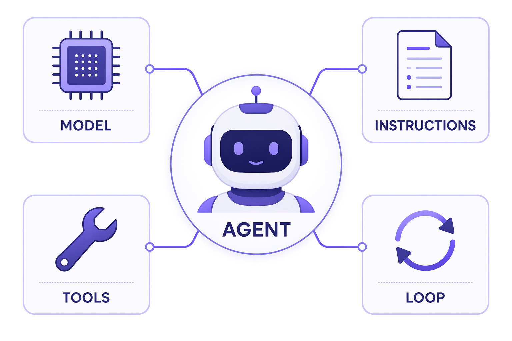

# Agentic AI — Building, Optimizing & Operationalizing Agents

> A **one-day, hands-on coding workshop** on the open-source **Microsoft Agent Framework** (Python).

{ .off-glb }

Welcome! By the end of today you will have built a real agent from first
principles — and you will understand *why* each piece exists. We start from a
single LLM call and end with a fully-assembled **agent harness**: tools,
memory, planning, multi-agent orchestration, evaluation, and observability.

Everything here is **code-first** and **provider-agnostic**. Pick your model
backend — Azure AI Foundry, OpenAI, Azure OpenAI, Anthropic, Ollama, AWS
Bedrock, or Google Gemini — and run the exact same notebooks. You change **one
environment variable**, not your code.

---

## What you'll build

| Module | You'll learn to… |
|:--|:--|
| **[M1 · Your First Agent](modules/01-first-agent.ipynb)** | Create and run an agent; understand the agent loop and streaming. |
| **[M2 · Tools & Function Calling](modules/02-tools.ipynb)** | Give the agent "hands" with function tools, approvals, and schemas. |
| **[M3 · Context Engineering](modules/03-context-engineering.ipynb)** | Manage what goes into the context window: sessions, memory, compaction. |
| **[M4 · The Agent Harness](modules/04-agent-harness.ipynb)** ★ | Assemble the full harness with `create_harness_agent`: todos, plan/execute modes, skills, durable memory. |
| **[M5 · Multi-Agent Orchestration](modules/05-orchestration.ipynb)** | Coordinate many agents: sequential, concurrent, handoff, group chat, workflows. |
| **[M6 · Evaluating & Optimizing](modules/06-evaluation.ipynb)** | Measure agent quality and close the optimization loop. |
| **[M7 · Operationalizing](modules/07-operationalize.ipynb)** | Trace, log, and guard agents with OpenTelemetry and middleware. |
| **[M8 · Capstone & Hosting](modules/08-capstone.ipynb)** | Combine everything into one app; explore A2A and hosting paths. |

★ = the centerpiece of the day.

---

## Agenda at a glance

| Time | Session | Format |
|:--|:--|:--:|
| *before today* | **Setup** — install, pick a provider, smoke test | Self-paced |
| 9:00 – 9:30 | What is agentic AI? Agents vs. chatbots; the harness | Lecture |
| 9:30 – 10:30 | **M1 · Your First Agent** | Lab |
| 10:45 – 11:45 | **M2 · Tools & Function Calling** | Lab |
| 11:45 – 12:30 | **M3 · Context Engineering** | Lab |
| 13:15 – 14:15 | **M4 · The Agent Harness** ★ | Lab |
| 14:15 – 15:15 | **M5 · Multi-Agent Orchestration** | Lab |
| 15:30 – 16:15 | **M6 · Evaluating & Optimizing** | Lab |
| 16:15 – 17:00 | **M7 · Operationalizing** + wrap-up | Lab + Lecture |
| *after today* | **M8 · Capstone & Hosting** | Self-paced |

---

## How to use this site

1. **Start with [Setup](setup.md)** — do this *before* the workshop. It takes ~15 minutes.
2. **Read [Concepts](concepts.md)** for the mental model that ties the labs together.
3. **Work through the labs in order** (M1 → M8). Each notebook is self-contained and
   has a "🧪 Your turn" exercise at the end.

!!! tip "Run it yourself, anytime"
    Every lab is a Jupyter notebook. Use the **Download** link at the top of each
    lab page to run it locally, or open the repo in your editor. The labs are
    designed to be completed **without an instructor** — so you can revisit them later.

---

## Prerequisites

- **Python 3.10+** and basic Python experience
- A model provider account (one of: Azure AI Foundry, OpenAI, Azure OpenAI,
  Anthropic, AWS Bedrock, Google Gemini) **or** a local [Ollama](https://ollama.com) install
- ~15 minutes to complete [Setup](setup.md)

Ready? → **[Set up your environment](setup.md)**
